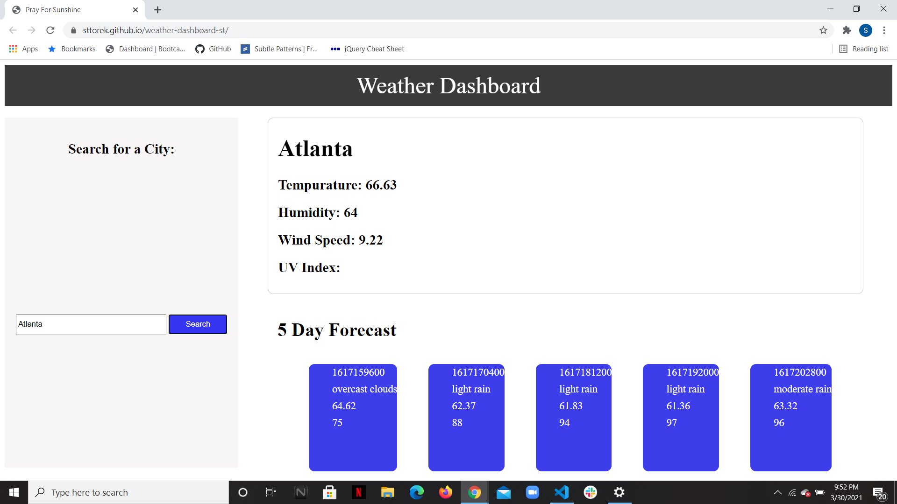

# weather-dashboard-st

In this assignment I created a weather dashboard using two API's. You can check your current city's weather for the day and get the forecast for the next five days. 

site-https://sttorek.github.io/weather-dashboard-st/

